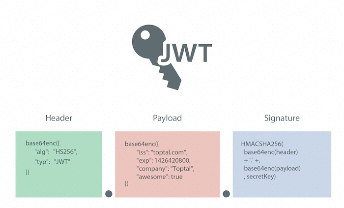

# JWT

 JSON Web Tokens are an open, industry standard [RFC 7519](https://tools.ietf.org/html/rfc7519) method for representing claims securely between two parties.

####  Header: Algoritm base

####  Payload: Data Claim

####  Signature: Secret Password

